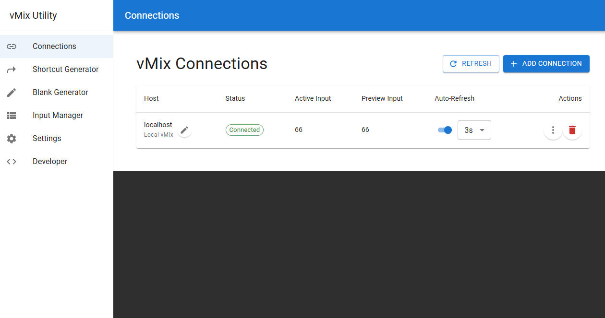
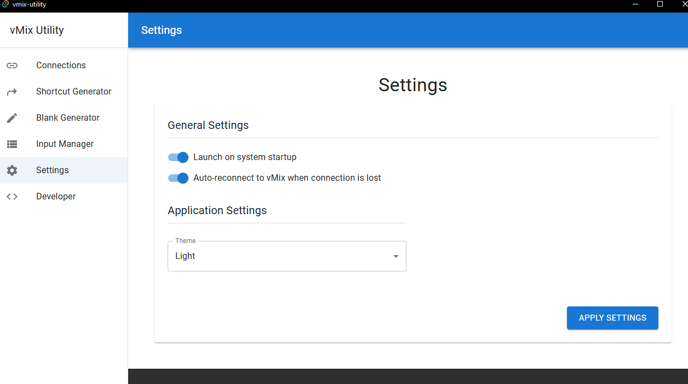
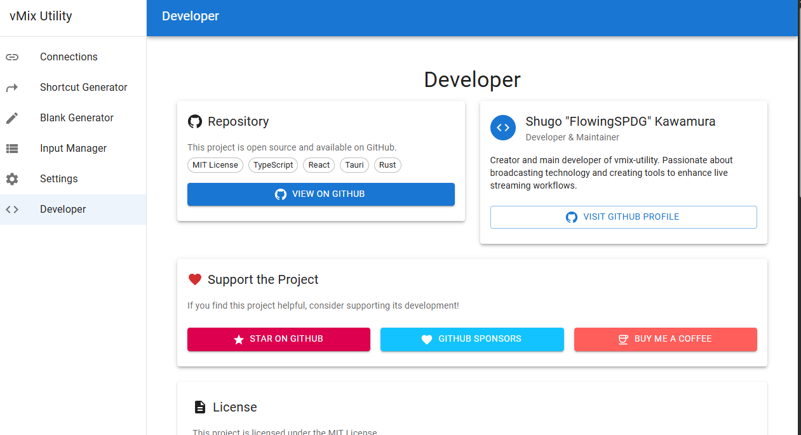

# vmix-utility

[](https://github.com/FlowingSPDG/vmix-utility/actions/workflows/test-build.yml)
[](https://github.com/FlowingSPDG/vmix-utility/actions/workflows/release.yml)

vMix接続と操作を管理するモダンなデスクトップアプリケーション。高性能とネイティブデスクトップ統合を実現するTauri（Rust + React）で構築されています。

## ✨ 機能

- **🔗 複数vMixへの同時接続**: 複数のvMixインスタンスに同時接続・管理
- **📊 リアルタイム状態監視**: 接続状態、アクティブ/プレビュー入力のライブ監視
- **🎮 vMix制御**: HTTP APIでvMixの制御
- **⚡ 自動更新**: 再試行ロジック付きの設定可能な自動状態更新
- **🎯 入力管理**: 詳細情報付きのvMix入力の参照と管理
- **⚙️ ショートカット生成**: パラメータ付きvMix Function Shortcutの作成
- **📝 Blank Input生成**: vMix用ブランク/カラー入力の生成
- **🔄 自動アップデート**: GitHubリリース経由での自動アプリケーション更新
- **💾 設定の永続化**: 接続設定の保存と復元
- **📱 システムトレイ統合**: システムトレイへの最小化とクイックアクセスメニュー
- **🎨 モダンUI**: レスポンシブデザインのクリーンなMaterial-UIベースインターフェース


*接続管理画面*

## 🚀 インストール

### ビルド済みリリースのダウンロード

お使いのプラットフォーム向けの最新版をダウンロードしてください

- **Windows**: [Releases](https://github.com/FlowingSPDG/vmix-utility/releases)から`.msi`インストーラーをダウンロード
- **macOS**: `.dmg`ファイルをダウンロード（Intel・Apple Silicon両対応）
- **Linux**: `.AppImage`ファイルをダウンロード

### システム要件

- **Windows**: Windows 10 バージョン1903以降
- **macOS**: macOS 10.15以降
- **Linux**: GTK 3.24以降を搭載したモダンなLinuxディストリビューション

## 📖 使用方法

### はじめに

1. **アプリケーションの起動** - アプリはデフォルトでlocalhostに接続された状態で開始されます
2. **vMix接続の追加** - "Connection"タブでvMixの追加・削除が可能です
3. **状態の監視** - リアルタイムの接続状態と入力情報を表示します
4. **Functionの実行** - GUIを使用してvMixを制御


*アプリケーション設定と構成*

### vMix接続の追加

1. **Connection**タブに移動
2. **Add Connection**をクリック
3. vMixホストのIPアドレスを入力（例：`192.168.1.100`）
4. 必要に応じてカスタムラベルを設定
5. 自動更新設定を必要に応じて構成

### vMix機能の使用

このアプリケーションは[vMix Web Scripting Reference](https://www.vmix.com/help28/index.htm?WebScripting.html)に記載されているすべてのvMix機能をサポートしています。

#### Function パラメータ

- **Function**: 利用可能なvMix機能から選択（Cut、Fade、SetTextなど）
- **Value**: 機能でサポートされている場合の追加値パラメータ
- **Input**: 入力キーまたは番号で指定されたターゲット入力
- **Custom Query**: 必要に応じて追加URLパラメータを追加

#### 機能例

- `Cut` - 指定したInputにプログラム出力を切り替え
- `Fade` - 指定したInputにFade
- `SetText` - タイトルのテキストを更新
- `StartRecording` - 録画開始
- `StopRecording` - 録画停止


*開発者ツールと機能テスト*

### ショートカット生成

頻繁に利用するvMix制御用のShortcutの作成が可能です。

1. **Shortcut Generator**タブに移動
2. Functionのパラメーターを入力

### システムトレイ

アプリケーションはシステムトレイに常駐します。

- **左クリック**: メインウィンドウを復元
- **右クリック**: コンテキストメニューにアクセス
  - 表示: メインウィンドウを復元
  - アップデート確認: 手動でアップデートを確認
  - 終了: アプリケーションを終了

## 🔄 自動アップデート

アプリケーションは起動時に自動でアップデートを確認し、システムトレイメニューから手動で実行することもできます。アップデートが利用可能な場合は以下が実行されます。

1. 通知が表示されます
2. クリックしてアップデートをダウンロード・インストール
3. アプリケーションが新バージョンで再起動されます

アップデートはセキュリティのため署名され検証されます。

## ⚙️ 設定

### 接続設定

- **Host**: vMixサーバーのIPアドレス
- **Label**: 接続のカスタム表示名
- **Auto-Update**: 自動状態更新の有効/無効
- **Update interval**: 状態チェック間の時間（秒）

### アプリケーション設定

- **テーマ**: ライト/ダークテーマの選択(WIP)
- **自動再接続**: 失敗した接続を自動で再試行
- **ログ**: ログレベルとファイル出力の構成

## 🛠️ 開発

### 前提条件

- [Node.js](https://nodejs.org/)（LTSバージョン）
- [Rust](https://rustup.rs/)（最新安定版）
- [Bun](https://bun.sh/)パッケージマネージャー

### セットアップ

```bash
git clone https://github.com/FlowingSPDG/vmix-utility.git
cd vmix-utility/app
bun install
```

### 開発コマンド

```bash
# 開発サーバーを開始
bun run tauri dev

# 本番用にビルド
bun run tauri build

# フロントエンドのみ実行
bun run dev

# フロントエンドをビルド
bun run build
```

### プロジェクト構成

```
vmix-utility/
├── app/                    # Tauriアプリケーション
│   ├── src/               # Reactフロントエンド
│   ├── src-tauri/         # Rustバックエンド
│   └── package.json
├── .github/workflows/     # CI/CDワークフロー
└── README.md
```

### 技術スタック

- **フロントエンド**: React + TypeScript + Material-UI + Vite
- **バックエンド**: Rust + Tauriフレームワーク
- **vMix API**: HTTP API通信 (TCP APIも対応予定)
- **ビルドシステム**: Tauri CLIとBunパッケージマネージャー

## 📋 vMix機能リファレンス

### 映像切り替え
- `Cut` - Inputのカット
- `Fade` - Inputへのフェードトランジション
- `PreviewInput` - Preview Inputを設定

### 録画・配信
- `StartRecording` / `StopRecording` - 録画開始/停止
- `StartStreaming` / `StopStreaming` - 配信開始/停止
- `PauseRecording` / `UnpauseRecording` - 録画一時停止/再開

### テキスト・グラフィック
- `SetText` - テキストオーバーレイの更新
- `OverlayInput1On` / `OverlayInput1Off` - オーバーレイの制御

### オーディオ
- `SetMasterVolume` - マスターボリューム調整
- `AudioMute` / `AudioUnMute` - オーディオのミュート/ミュート解除

完全なFunction Referenceについては、[vMix Web Scripting Document](https://www.vmix.com/help28/index.htm?WebScripting.html)を参照してください。

## 🤝 貢献

コードの修正・機能追加などは大歓迎です。  
バグや機能リクエストについては、PRの提出やissue経由でお知らせください。

### 開発ワークフロー

1. リポジトリをフォーク
2. ブランチを作成（`git checkout -b feature/amazing-feature`）
3. 変更をコミット（`git commit -m 'Add amazing feature'`）
4. ブランチにプッシュ（`git push origin feature/amazing-feature`）
5. プルリクエストを作成

## 📄 ライセンス

このプロジェクトはMITライセンスの下でライセンスされています。詳細は[LICENSE](LICENSE)ファイルを参照してください。

## 👨‍💻 開発者

**河村 柊吾（Shugo Kawamura）**
- GitHub: [@FlowingSPDG](https://github.com/FlowingSPDG)
- X (Twitter): [@FlowingSPDG](https://x.com/FlowingSPDG)

## 🔗 リンク

- [最新リリースをダウンロード](https://github.com/FlowingSPDG/vmix-utility/releases/latest)
- [問題を報告](https://github.com/FlowingSPDG/vmix-utility/issues)
- [vMix公式サイト](https://www.vmix.com/)
- [vMix Webスクリプティングリファレンス](https://www.vmix.com/help28/index.htm?WebScripting.html)

---

⭐ このアプリケーションが役立つと思われましたら、GitHubでスターを付けることをご検討ください！
