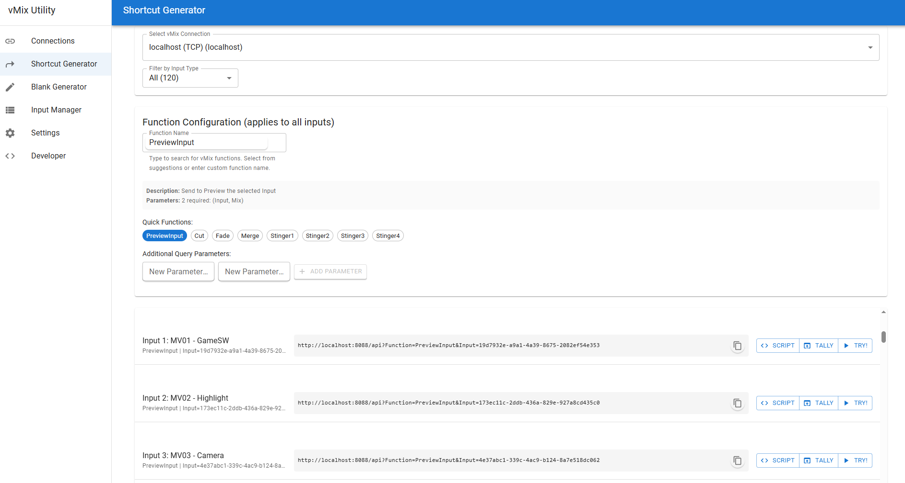

# vmix-utility

[](https://github.com/FlowingSPDG/vmix-utility/actions/workflows/test-build.yml)
[](https://github.com/FlowingSPDG/vmix-utility/actions/workflows/release.yml)

vMix接続と操作を管理するモダンなデスクトップアプリケーション。高性能とネイティブデスクトップ統合を実現するTauri（Rust + React）で構築されています。

## ✨ 機能

- **🔗 複数vMix接続**: 複数のvMixインスタンスに同時接続・管理
- **📊 リアルタイム状態監視**: 接続状態、アクティブ/プレビュー入力のライブ監視
- **🎮 vMix機能制御**: カスタマイズ可能なパラメータでvMix機能を実行
- **⚡ 自動更新**: 再試行ロジック付きの設定可能な自動状態更新
- **🎯 入力管理**: 詳細情報付きのvMix入力の参照と管理
- **⚙️ ショートカット生成**: パラメータ付きカスタムvMix機能ショートカットの作成
- **📝 ブランク生成**: vMix用ブランク/カラー入力の生成
- **🔄 自動アップデート**: GitHubリリース経由での自動アプリケーション更新
- **💾 設定の永続化**: 接続設定の保存と復元
- **📱 システムトレイ統合**: システムトレイへの最小化とクイックアクセスメニュー
- **🎨 モダンUI**: レスポンシブデザインのクリーンなMaterial-UIベースインターフェース


*接続管理画面*

## 🚀 インストール

### ビルド済みリリースのダウンロード

お使いのプラットフォーム用の最新版をダウンロード:

- **Windows**: [Releases](https://github.com/FlowingSPDG/vmix-utility/releases)から`.msi`インストーラーをダウンロード
- **macOS**: `.dmg`ファイルをダウンロード（Intel・Apple Silicon両対応）
- **Linux**: `.AppImage`ファイルをダウンロード

### システム要件

- **Windows**: Windows 10 バージョン1903以降
- **macOS**: macOS 10.15以降
- **Linux**: GTK 3.24以降を搭載したモダンなLinuxディストリビューション

## 📖 使用方法

### はじめに

1. **アプリケーションの起動** - アプリはデフォルトのlocalhost接続で開始されます
2. **vMix接続の追加** - 接続タブでvMixインスタンスを追加します
3. **状態の監視** - リアルタイムの接続状態と入力情報を表示します
4. **機能の実行** - 機能インターフェースを使用してvMix操作を制御します


*アプリケーション設定と構成*

### vMix接続の追加

1. **接続**タブに移動
2. **接続を追加**をクリック
3. vMixホストのIPアドレスを入力（例：`192.168.1.100`）
4. 必要に応じて識別しやすいカスタムラベルを設定
5. 自動更新設定を必要に応じて構成

### vMix機能の使用

このアプリケーションは[vMix Webスクリプティングリファレンス](https://www.vmix.com/help28/index.htm?WebScripting.html)に記載されているすべてのvMix機能をサポートしています。

#### 機能パラメータ

- **機能**: 利用可能なvMix機能から選択（Cut、Fade、SetTextなど）
- **値**: 機能でサポートされている場合の追加値パラメータ
- **入力**: 入力キーまたは番号で指定されたターゲット入力
- **カスタムクエリ**: 必要に応じて追加URLパラメータを追加

#### 機能例

- `Cut` - 指定した入力にプログラム出力を切り替え
- `Fade` - 指定した入力に時間をかけてフェード
- `SetText` - タイトル入力のテキストを更新
- `StartRecording` - 録画開始
- `StopRecording` - 録画停止


*開発者ツールと機能テスト*

### ショートカット生成

一般的なvMix操作用の再利用可能なショートカットを作成:

1. **ショートカット生成**タブに移動
2. 機能パラメータを構成
3. カスタム名でショートカットを保存
4. 共有やバックアップ用にショートカットをエクスポート

### システムトレイ

アプリケーションは簡単にアクセスできるようシステムトレイに最小化されます:

- **左クリック**: メインウィンドウを復元
- **右クリック**: コンテキストメニューにアクセス
  - 表示: メインウィンドウを復元
  - アップデート確認: 手動でアップデートを確認
  - 終了: アプリケーションを終了

## 🔄 自動アップデート

アプリケーションは起動時に自動でアップデートを確認し、システムトレイメニューから手動で実行することもできます。アップデートが利用可能な場合:

1. 通知が表示されます
2. クリックしてアップデートをダウンロード・インストール
3. アプリケーションが新バージョンで再起動されます

アップデートはセキュリティのため署名され検証されます。

## ⚙️ 設定

### 接続設定

- **ホスト**: vMixサーバーのIPアドレス
- **ラベル**: 接続のカスタム表示名
- **自動更新**: 自動状態更新の有効/無効
- **更新間隔**: 状態チェック間の時間（秒）

### アプリケーション設定

- **スタートアップ起動**: システム起動時にアプリケーションを起動
- **デフォルトvMix設定**: 新規接続のデフォルトIPとポート
- **テーマ**: ライト/ダークテーマの選択
- **自動再接続**: 失敗した接続を自動で再試行
- **ログ**: ログレベルとファイル出力の構成

## 🛠️ 開発

### 前提条件

- [Node.js](https://nodejs.org/)（LTSバージョン）
- [Rust](https://rustup.rs/)（最新安定版）
- [Bun](https://bun.sh/)パッケージマネージャー

### セットアップ

```bash
git clone https://github.com/FlowingSPDG/vmix-utility.git
cd vmix-utility/app
bun install
```

### 開発コマンド

```bash
# 開発サーバーを開始
bun run tauri dev

# 本番用にビルド
bun run tauri build

# フロントエンドのみ実行
bun run dev

# フロントエンドをビルド
bun run build
```

### プロジェクト構成

```
vmix-utility/
├── app/                    # Tauriアプリケーション
│   ├── src/               # Reactフロントエンド
│   ├── src-tauri/         # Rustバックエンド
│   └── package.json
├── .github/workflows/     # CI/CDワークフロー
└── README.md
```

### アーキテクチャ

- **フロントエンド**: React + TypeScript + Material-UI + Vite
- **バックエンド**: Rust + Tauriフレームワーク
- **vMix統合**: HTTP API通信
- **ビルドシステム**: Tauri CLIとBunパッケージマネージャー

## 📋 vMix機能リファレンス

アプリケーションでサポートされている一般的なvMix機能:

### 映像切り替え
- `Cut` - 入力へのハードカット
- `Fade` - 入力へのフェードトランジション
- `PreviewInput` - プレビュー入力を設定

### 録画・配信
- `StartRecording` / `StopRecording` - 録画開始/停止
- `StartStreaming` / `StopStreaming` - 配信開始/停止
- `PauseRecording` / `UnpauseRecording` - 録画一時停止/再開

### テキスト・グラフィック
- `SetText` - テキストオーバーレイの更新
- `OverlayInput1On` / `OverlayInput1Off` - オーバーレイの制御

### オーディオ
- `SetMasterVolume` - マスターボリューム調整
- `AudioMute` / `AudioUnMute` - オーディオのミュート/ミュート解除

完全な機能リファレンスについては、[vMix Webスクリプティングドキュメント](https://www.vmix.com/help28/index.htm?WebScripting.html)を参照してください。

## 🤝 コントリビューション

コントリビューションを歓迎します！バグや機能リクエストについては、プルリクエストの提出やissueの作成をお気軽にどうぞ。

### 開発ワークフロー

1. リポジトリをフォーク
2. 機能ブランチを作成（`git checkout -b feature/amazing-feature`）
3. 変更をコミット（`git commit -m 'Add amazing feature'`）
4. ブランチにプッシュ（`git push origin feature/amazing-feature`）
5. プルリクエストを作成

## 📄 ライセンス

このプロジェクトはMITライセンスの下でライセンスされています。詳細は[LICENSE](LICENSE)ファイルを参照してください。

## 👨‍💻 開発者

**川村周吾（Shugo Kawamura）**
- GitHub: [@FlowingSPDG](https://github.com/FlowingSPDG)
- X (Twitter): [@FlowingSPDG](https://twitter.com/FlowingSPDG)

## 🔗 リンク

- [最新リリースをダウンロード](https://github.com/FlowingSPDG/vmix-utility/releases/latest)
- [問題を報告](https://github.com/FlowingSPDG/vmix-utility/issues)
- [vMix公式サイト](https://www.vmix.com/)
- [vMix Webスクリプティングリファレンス](https://www.vmix.com/help28/index.htm?WebScripting.html)

---

⭐ このアプリケーションが役立つと思われましたら、GitHubでスターを付けることをご検討ください！